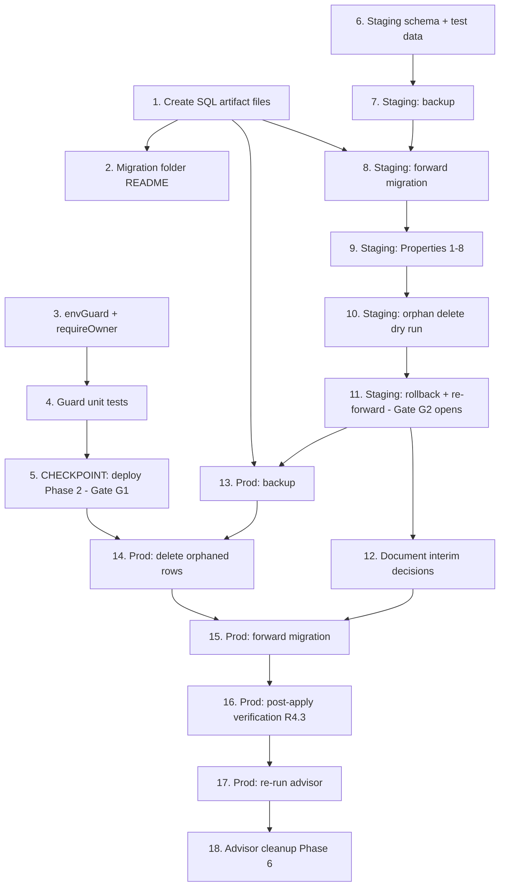

# Implementation Plan

## Overview

Sequenced to the design's phases (0–6). Hard rules baked into ordering:

- **Gate G1**: Phase 2 (app-side) must be implemented, deployed, and verified
  before any Phase 3 (orphaned deletion) task begins.
- **Gate G2**: All staging tasks (Phase S) must be marked passed before ANY
  production task (anything touching `yxgtmzksnyarlivgxujf`) begins.
- No task bundles "write code" and "apply migration" — every apply has a
  reviewable checkpoint before it.
- **Nothing runs against production until staging rehearsal fully passes.**

Accepted interim states (documented, see Task 12):
- Phase 5 (server-side relocation of `audit_events` / `template_refunds` /
  `agent_run_logs` writes) is **deferred**; interim authenticated-write policies
  stand.
- `creator_profiles` remains owner-only (no public read) for v1.

Blocked until owner provides input: **staging project ref** (Task 6 onward).

## Tasks

---

## Phase 1 — Artifacts prepared (no DB execution)

- [x] 1. Create migration SQL artifact files from the approved design
  - Add `supabase/migrations/rls/forward_owner_scoped.sql` (full forward
    migration from design, verbatim)
  - Add `supabase/migrations/rls/rollback_allow_all.sql` (rollback migration
    from design, verbatim)
  - Add `supabase/migrations/rls/delete_account_rpc.sql` (the `delete_account()`
    SECURITY DEFINER function)
  - Add `supabase/migrations/rls/backup_pages_aichats.sql` and
    `orphan_delete.sql` (backup + deletion scripts)
  - No execution; these are reviewable text files under version control
  - _Requirements: 4.1, 5.1_

- [x] 2. Add a README to the migration folder documenting run order and gates
  - Document phase order, G1/G2 gates, and "review before apply" rule
  - List which script belongs to which phase
  - _Requirements: 5.1, 5.2_

## Phase 2 — App-side BEFORE changes (code + tests, no DB execution)

- [x] 3. Implement the environment guard and owner-required write guard
- [x] 3.1 Create `src/lib/envGuard.js`
  - Export `IS_PROD_PROJECT`, `TEST_MODE` per design; throw if test mode + prod URL
  - _Requirements: 1.4, 6.3_
- [x] 3.2 Add `requireOwner(userId)` to `src/lib/supabaseService.js` and apply it
  - Guard `savePage`, `savePages`, `saveAIChats`, `saveAIChat`,
    `upsertUserProfile`, `saveAgent`, `saveAgentRunLog`, refund insert
  - Always set the owner column to the passed authenticated id
  - _Requirements: 6.2, 6.4_
- [x] 3.3 Route `App.jsx` through `TEST_MODE` and remove the null-owner write path
  - Replace direct `import.meta.env.VITE_TEST_MODE` reads with `TEST_MODE`
  - Ensure the `!userId` guest branch never calls Supabase write functions
    (localStorage-only for guests; guests routed to login per 6.1)
  - _Requirements: 1.3, 6.1, 6.2_

- [x] 4. Write and run app-layer unit tests for the guards (Properties 6 & 7)
- [x] 4.1 Test `requireOwner` rejects null/empty owner (Property 6)
  - _Requirements: 1.3, 6.2_
- [x] 4.2 Test `envGuard` throws on prod-URL + test mode, yields `TEST_MODE=true`
        otherwise (Property 7)
  - _Requirements: 1.4, 6.3_
- [x] 4.3 Run full test suite + `npm run build`; confirm green before deploy
  - _Requirements: 6.1, 6.2, 6.3, 6.4_

- [ ] 5. **CHECKPOINT (Gate G1 part 1)** — deploy Phase 2 and verify in production app
  - Deploy the app-side changes; confirm unauthenticated users hit login and
    issue no Supabase writes
  - **Verification window: 24–48 hours of real production usage** (not a
    spot-check). Confirm `SELECT count(*) FROM pages WHERE user_id IS NULL` stays
    flat across the full window before marking this task passed
  - This is app deploy only — NOT the RLS migration
  - _Requirements: 6.1, 6.2, 6.4_

## Phase S — Staging rehearsal (BLOCKED until staging ref provided; Gate G2)

> Owner must create the free staging project per design steps and provide the
> ref. No task below runs against `yxgtmzksnyarlivgxujf`.

- [ ] 6. Stand up the staging project schema + test data
  - Recreate schema in staging; create ≥2 auth test users (A, B); seed a few
    owned rows per user and one `marketplace_templates` published + one draft
  - Record staging project ref in this spec
  - _Requirements: 5.3_

- [ ] 7. Staging: run backup script (Phase 0) and verify restorability
  - Run `backup_pages_aichats.sql` against staging; confirm snapshot counts match
    seeded counts; test-restore into a scratch table
  - _Requirements: 3.1_

- [ ] 8. Staging: apply forward migration (Phase 4) after SQL re-review
- [ ] 8.1 Present the exact staging SQL for review checkpoint
  - _Requirements: 5.1, 5.2_
- [ ] 8.2 Apply `forward_owner_scoped.sql` + `delete_account_rpc.sql` to staging
  - _Requirements: 2.1–2.18, 4.1_

- [ ] 9. Staging: run property/integration tests (Properties 1–8) against staging
- [ ] 9.1 Property 1 — owner isolation (A cannot touch B's rows, any table/op)
  - _Requirements: 1.1, 1.2, 2.1, 2.2_
- [ ] 9.2 Property 2 — anonymous denial (0 rows / 0 affected on all owner tables)
  - _Requirements: 1.1, 1.2_
- [ ] 9.3 Property 3 — owner round-trip (own insert readable only by owner)
  - _Requirements: 2.1, 2.2, 6.4_
- [ ] 9.4 Property 4 — published visibility for `marketplace_templates`
  - _Requirements: 2.16_
- [ ] 9.5 Property 5 — `page_versions` append-only (no UPDATE/DELETE)
  - _Requirements: 2.4_
- [ ] 9.6 Properties 6 & 7 — re-run app-layer guard tests against staging config
  - _Requirements: 1.3, 1.4, 6.2, 6.3_
- [ ] 9.7 Verify `ai_memory` has zero client access; `workspace_settings` is
        auth-read/no client write; `delete_account()` cascades and retains
        `audit_events`
  - _Requirements: 2.17, 2.18, 2.3_

- [ ] 10. Staging: orphaned-deletion dry run (Phase 3) in correct order
  - Confirm null-owner deletion behaves; confirm no owned rows lost
  - _Requirements: 3.2, 3.3, 3.4_

- [ ] 11. Staging: rollback + re-forward test (Property 8)
  - Apply `rollback_allow_all.sql`; confirm access returns to `Allow all`
    behavior; re-apply forward; confirm scoped access restored
  - **Mark all Phase S tasks passed = Gate G2 opens**
  - _Requirements: 4.1, 4.2_

## Phase 3–4 — Production migration (BLOCKED by Gate G2; needs explicit approval)

> Only after every Phase S task is passed AND owner re-confirms. Production ref
> `yxgtmzksnyarlivgxujf` confirmed by owner.

- [ ] 12. Update running documentation/backlog with accepted interim decisions
  - Record: Phase 5 deferral (interim authenticated-write for `audit_events`,
    `template_refunds`, `agent_run_logs` — revisit before security-sensitive
    scale); `creator_profiles` owner-only v1; `block_locks` owner-only accepted
  - _Requirements: 6.6_

- [ ] 13. Production: backup `pages` + `ai_chats` and verify (Phase 0)
  - Run backup script against production; confirm counts 80 / 13; external export
    confirmed restorable BEFORE any change
  - _Requirements: 3.1_

- [ ] 14. Production: delete orphaned NULL-owner rows (Phase 3) — after Gate G1
  - Confirm Phase 2 is live (Task 5 passed) so no new NULL rows are being created
  - Run `orphan_delete.sql`; confirm 0 NULL-owner rows remain (pages→18, chats→0)
  - _Requirements: 3.2, 3.3, 3.4_

- [ ] 15. Production: apply forward migration (Phase 4) after final SQL re-review
- [ ] 15.1 Present exact production SQL + confirm read-write MCP/dashboard step is gated
  - _Requirements: 5.1, 5.2, 5.4_
- [ ] 15.2 Apply `forward_owner_scoped.sql` + `delete_account_rpc.sql` to production
  - _Requirements: 2.1–2.18, 4.1_

- [ ] 16. Production: post-apply verification (R4.3) — REQUIRED, not optional
  - Run the three-part verification with real accounts A & B: (a) own access
    works, (b) cross-account blocked, (c) anonymous denied; published-template
    read visible to auth users
  - Any failure → immediately apply `rollback_allow_all.sql`
  - Production migration is NOT "done" until all three pass
  - _Requirements: 4.3_

- [ ] 17. Production: re-run security advisor and confirm `rls_policy_always_true`
        findings cleared for the migrated tables
  - Confirm no remaining `Allow all` policies on owner-scoped tables
  - _Requirements: 2.1–2.18_

## Phase 6 — Advisor cleanup (after lockdown verified)

- [ ] 18. Address lower-severity advisor findings
  - Set `search_path=''` on `update_updated_at`, `release_expired_locks`,
    `clean_stale_sessions`, `update_updated_at_column`; move `pg_trgm` out of
    `public`; enable leaked-password protection
  - Present as reviewed SQL; apply to staging first, then production
  - _Requirements: 6.6_

## Task Dependency Graph



Critical gates:
- **G1** (Task 5 passed) blocks Task 14 (no orphan deletion before app stops
  creating null-owner rows).
- **G2** (Task 11 passed) blocks all production tasks 13–18.

```json
{
  "waves": [
    { "wave": 1, "tasks": ["1", "3", "6"] },
    { "wave": 2, "tasks": ["2", "4", "7"] },
    { "wave": 3, "tasks": ["5", "8"] },
    { "wave": 4, "tasks": ["9"] },
    { "wave": 5, "tasks": ["10"] },
    { "wave": 6, "tasks": ["11"] },
    { "wave": 7, "tasks": ["12", "13"] },
    { "wave": 8, "tasks": ["14"] },
    { "wave": 9, "tasks": ["15"] },
    { "wave": 10, "tasks": ["16"] },
    { "wave": 11, "tasks": ["17"] },
    { "wave": 12, "tasks": ["18"] }
  ]
}
```

## Notes

- **No execution yet.** All SQL lives as reviewable text (Task 1). The Supabase
  MCP is read-only; enabling write access is itself a gated, owner-approved step.
- **Interim state (accepted):** `audit_events`, `template_refunds`,
  `agent_run_logs` keep authenticated-write policies because their writes are
  currently client-side. Phase 5 (server relocation) is deferred and must be
  revisited before these tables carry security-sensitive data at scale.
- **`block_locks` owner-only** is accepted; revisit with participant-scoped RLS
  when real-time collaboration ships.
- **`delete_account()`** intentionally retains `audit_events` rows for audit
  integrity.
- Execution proceeds task-by-task, starting with staging project setup (Task 6)
  and Phase 2 app changes (Tasks 3–5), only after this plan is reviewed.
