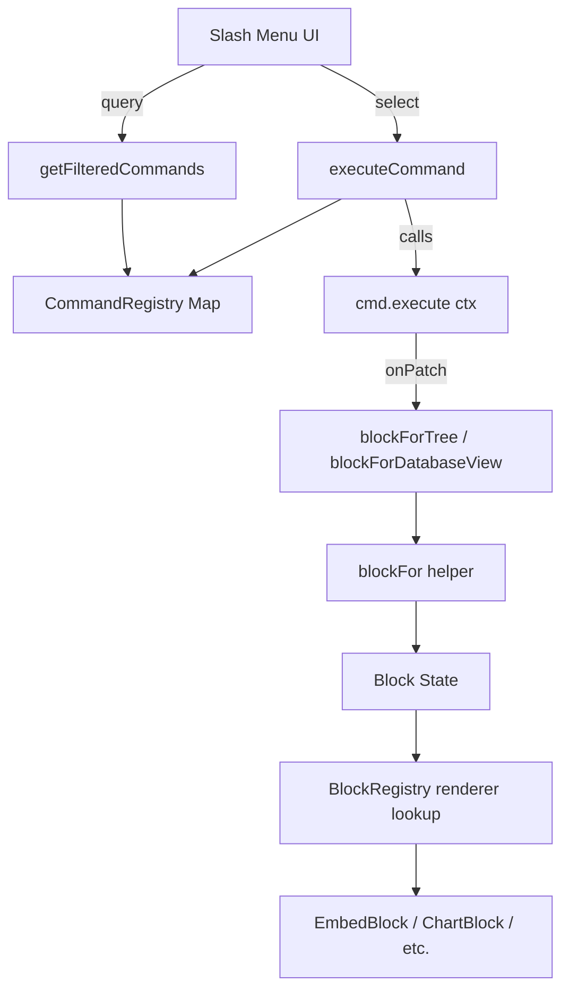

# Design Document: Notion Command Parity

## Overview

This feature brings Noska's slash command system to full parity with Notion by adding all missing commands and ensuring every registered command has a correct, functional `execute()` implementation. The work is scoped to three areas:

1. **Missing embed commands** (20 new services: Abstract, Invision, Mixpanel, Framer, Whimsical, Miro, Sketch, Excalidraw, Typeform, Replit, Hex, Deepnote, Trello, Dropbox Paper, Evernote, Workflowy, Word, Monday, Quip, ZIP)
2. **Missing database chart/view commands** (bar-chart-v, bar-chart-h, line-chart, donut-chart, number-chart, feed-view, linked-view)
3. **Execute function correctness** — audit and fix all commands to ensure they produce the right block type with proper initial state

The implementation is low-risk because the rendering infrastructure (BlockRegistry, EmbedBlock, helpers) already supports all the types. The work is purely in CommandRegistry: adding entries and wiring execute functions to existing helpers.

## Architecture



**Key architectural decisions:**

- All new embed commands follow the established pattern: `ctx.onPatch(blockForTree(ctx.block, "embed-generic", ctx.text))`. The EmbedBlock component handles provider detection from the URL at render time.
- Chart commands use `blockForTree` with the specific chart type (e.g., `"bar-chart-v"`), since `blockFor()` already has TYPE_TO_PROPS mappings for all chart types.
- Feed-view uses `blockForDatabaseView(ctx.block, "feed", ctx.text)` following the existing database view command pattern.
- Linked-view uses `blockForTree(ctx.block, "linked-view", ctx.text)` since it's a distinct block type requiring user interaction to select a data source.

## Components and Interfaces

### CommandRegistry (modified)

**File:** `src/core/commands/CommandRegistry.js`

New commands added to the `embeds` array:

| Command ID | Title | Category | Execute Pattern |
|---|---|---|---|
| abstract | Abstract | Embeds | `blockForTree(block, "embed-generic", text)` |
| invision | Invision | Embeds | `blockForTree(block, "embed-generic", text)` |
| mixpanel | Mixpanel | Embeds | `blockForTree(block, "embed-generic", text)` |
| framer | Framer | Embeds | `blockForTree(block, "embed-generic", text)` |
| whimsical | Whimsical | Embeds | `blockForTree(block, "embed-generic", text)` |
| miro | Miro | Embeds | `blockForTree(block, "embed-generic", text)` |
| sketch | Sketch | Embeds | `blockForTree(block, "embed-generic", text)` |
| excalidraw | Excalidraw | Embeds | `blockForTree(block, "embed-generic", text)` |
| typeform | Typeform | Embeds | `blockForTree(block, "embed-generic", text)` |
| replit | Replit | Embeds | `blockForTree(block, "embed-generic", text)` |
| hex | Hex | Embeds | `blockForTree(block, "embed-generic", text)` |
| deepnote | Deepnote | Embeds | `blockForTree(block, "embed-generic", text)` |
| trello | Trello | Embeds | `blockForTree(block, "embed-generic", text)` |
| dropbox-paper | Dropbox Paper | Embeds | `blockForTree(block, "embed-generic", text)` |
| evernote | Evernote | Embeds | `blockForTree(block, "embed-generic", text)` |
| workflowy | Workflowy | Embeds | `blockForTree(block, "embed-generic", text)` |
| word | Word | Embeds | `blockForTree(block, "embed-generic", text)` |
| monday | Monday | Embeds | `blockForTree(block, "embed-generic", text)` |
| quip | Quip | Embeds | `blockForTree(block, "embed-generic", text)` |
| zip | ZIP | Embeds | `blockForTree(block, "embed-generic", text)` |

New commands added to the `database` array:

| Command ID | Title | Category | Execute Pattern |
|---|---|---|---|
| bar-chart-v | Vertical bar chart | Database | `blockForTree(block, "bar-chart-v", text)` |
| bar-chart-h | Horizontal bar chart | Database | `blockForTree(block, "bar-chart-h", text)` |
| line-chart | Line chart | Database | `blockForTree(block, "line-chart", text)` |
| donut-chart | Donut chart | Database | `blockForTree(block, "donut-chart", text)` |
| number-chart | Number chart | Database | `blockForTree(block, "number-chart", text)` |
| feed-view | Feed view | Database | `blockForDatabaseView(block, "feed", text)` |
| linked-view | Linked view | Database | `blockForTree(block, "linked-view", text)` |

### Command Interface

Every command conforms to:

```javascript
{
  id: string,           // Unique identifier (kebab-case)
  title: string,        // Display name in slash menu
  aliases: string[],    // Alternative search terms
  icon: string,         // Lucide icon name
  category: string,     // One of: "Basic blocks" | "Media" | "Database" | "Advanced blocks" | "Layout" | "Inline" | "Embeds" | "Page actions"
  description: string,  // Short description for menu
  shortcut?: string,    // Optional keyboard shortcut hint
  preview: string | { description: string, image?: string },
  available?: (ctx) => boolean,  // Optional visibility gate
  execute: (ctx) => void         // Required action handler
}
```

### Execute Context Interface

```javascript
{
  page: object,          // Current page object
  pages: array,          // All pages in workspace
  block: object,         // Current block being transformed
  blocks: array,         // All blocks on current page
  text: string,          // Text after slash command (stripped)
  onPatch: (patch) => void,      // Update current block
  onAdd: (type, text) => void,   // Add new block after current
  onDelete: () => void,          // Delete current block
  onNavigate: (pageId) => void,  // Navigate to page
  onDuplicate: () => void,       // Duplicate block
  onBlocks: (blocks) => void,    // Bulk update blocks
  onPagePatch: (patch) => void,  // Patch page metadata
  onTrash: (pageId) => void,     // Trash a page
  onToast: (msg) => void,        // Show toast notification
  onAskAI: () => void,           // Trigger AI assistant
  onCreateSubpage: (blockId, text) => string,  // Create subpage
  onSetOpenSlashBlockId: (id) => void,
  setSlashOpen: (bool) => void,
  setCustomizeOpen: (bool) => void,
  onDuplicatePage: () => void,
  onImport: () => void,
  onExport: () => void,
  onAnalytics: () => void,
  onHistory: () => void,
}
```

### Helper Functions (unchanged)

```javascript
// Preserves block identity while changing type
function blockForTree(block, type, text) → { ...blockFor(type, text), id: block.id, parentId: block.parentId, content: block.content, text }

// Creates database block with specific view configuration  
function blockForDatabaseView(block, viewType, text) → { ...blockFor("database", text), id, parentId, content, database: { view: viewType, ... } }
```

## Data Models

### Block Structure (produced by execute functions)

```javascript
// Embed block (produced by embed commands)
{
  id: string,           // Preserved from source block
  type: "embed-generic",
  text: string,         // URL or empty (user enters later)
  parentId: string | null,
  content: array,       // Preserved from source block
}

// Chart block (produced by chart commands)
{
  id: string,
  type: "bar-chart-v" | "bar-chart-h" | "line-chart" | "donut-chart" | "number-chart",
  text: string,
  parentId: string | null,
  content: array,
}

// Database view block (produced by view commands)
{
  id: string,
  type: "database",
  text: string,
  parentId: string | null,
  content: array,
  database: { view: "feed" | "table" | "board" | ... , views: [...], ... },
  properties: { view: string },
}

// Linked view block
{
  id: string,
  type: "linked-view",
  text: string,
  parentId: string | null,
  content: array,
}
```

## Correctness Properties

*A property is a characteristic or behavior that should hold true across all valid executions of a system — essentially, a formal statement about what the system should do. Properties serve as the bridge between human-readable specifications and machine-verifiable correctness guarantees.*

### Property 1: Embed commands produce embed-generic blocks

*For any* embed command id from the set {abstract, invision, mixpanel, framer, whimsical, miro, sketch, excalidraw, typeform, replit, hex, deepnote, trello, dropbox-paper, evernote, workflowy, word, monday, quip, zip} and *for any* valid block context, executing the command SHALL produce a patch with type "embed-generic" and preserve the source block's id, parentId, and content array.

**Validates: Requirements 1.1, 1.2, 1.3, 1.4, 1.5, 1.6, 1.7, 1.8, 1.9, 1.10, 1.11, 1.12, 1.13, 1.14, 1.15, 1.16, 1.17, 1.18, 1.19**

### Property 2: Chart commands produce matching chart-type blocks

*For any* chart command id from the set {bar-chart-v, bar-chart-h, line-chart, donut-chart, number-chart} and *for any* valid block context, executing the command SHALL produce a patch with type equal to the command id and preserve the source block's id, parentId, and content array.

**Validates: Requirements 2.1, 2.2, 2.3, 2.4, 2.5**

### Property 3: Block identity preservation (blockForTree invariant)

*For any* command that uses blockForTree in its execute function and *for any* valid block context with an id, parentId, and content array, the resulting patch SHALL have the same id, same parentId, and same content array as the source block.

**Validates: Requirements 4.1, 4.2, 7.6**

### Property 4: Media commands clear text field

*For any* media command from the set {image, video, audio, file, bookmark} and *for any* valid block context regardless of input text content, executing the command SHALL produce a patch with text set to the empty string.

**Validates: Requirements 5.1, 5.2, 5.3, 5.4, 5.5**

### Property 5: Database view commands set correct view type

*For any* database view command from the set {table-view, board-view, gallery-view, list-view, calendar-view, timeline-view, dashboard-view, map-view, feed-view} and *for any* valid block context, executing the command SHALL produce a patch with `database.view` equal to the corresponding view type string.

**Validates: Requirements 6.1, 3.1**

### Property 6: Page toggle commands invert boolean state

*For any* toggle page-action command from the set {lock, full-width, small-text} and *for any* page with a boolean value for the corresponding property, executing the command SHALL call onPagePatch with the negated value of that property.

**Validates: Requirements 8.8, 8.9, 8.10**

### Property 7: Command search filter correctness

*For any* query string and registered command set, every command returned by `getFilteredCommands(query)` SHALL match the query (case-insensitive) in at least one of: title, aliases, or description. Furthermore, results whose title starts with the query SHALL appear before results matched only by alias or description.

**Validates: Requirements 10.2, 10.3**

### Property 8: Command registration invariant

*For all* registered commands in CommandRegistry, each command SHALL have: a non-empty unique id, a non-empty title, a non-empty icon string, a category from the valid set {"Basic blocks", "Media", "Database", "Advanced blocks", "Layout", "Inline", "Embeds", "Page actions"}, a non-empty description, and an execute function of type "function".

**Validates: Requirements 10.4, 10.5, 11.2**

### Property 9: Registry bidirectional completeness

*For all* block types listed in BlockRegistry, there SHALL exist a corresponding command in CommandRegistry. Conversely, *for all* commands in CommandRegistry that produce a block type (via blockForTree or blockForDatabaseView), that block type SHALL exist in BlockRegistry.

**Validates: Requirements 11.1, 11.3**

### Property 10: All execute functions produce side effects

*For any* registered command and *for any* valid context with mocked callbacks, executing the command SHALL invoke at least one context method (onPatch, onAdd, onDelete, onNavigate, onPagePatch, onToast, onDuplicatePage, onImport, onExport, onAnalytics, onHistory, onCreateSubpage, or setCustomizeOpen).

**Validates: Requirements 11.4**

### Property 11: Synced-block produces unique group IDs

*For any* two executions of the "synced-block" command with different block contexts, the resulting `syncedGroupId` values SHALL be distinct.

**Validates: Requirements 7.2**

## Error Handling

| Scenario | Handling |
|---|---|
| Command ID not found in registry | `executeCommand` logs warning, returns early (existing behavior in ActionExecutor) |
| Command not available (ctx check fails) | `executeCommand` logs warning, returns early |
| Execute function throws | `executeCommand` catches error, logs to console.error |
| `onPatch` / `onAdd` / other callbacks undefined | Execute functions use optional chaining (`ctx.onPatch?.()`) — no crash |
| `blockFor` receives unknown type | Falls back to `createBlock(type)` with text set |
| `blockForDatabaseView` with invalid viewType | Creates database with default views, sets view field to provided string |

No new error handling is needed — the existing ActionExecutor try/catch and helper fallbacks cover all cases. The new commands are purely additive and follow established patterns.

## Testing Strategy

### Property-Based Tests (fast-check)

The project will use [fast-check](https://github.com/dubzzz/fast-check) for property-based testing. Each property test runs a minimum of 100 iterations with randomly generated block contexts.

**Test configuration:**
- Library: `fast-check`
- Runner: Vitest (or Jest if already configured)
- Minimum iterations: 100 per property
- Tag format: `Feature: notion-command-parity, Property {N}: {title}`

**Properties to implement:**
1. Embed command block production
2. Chart command block production
3. Block identity preservation
4. Media commands clear text
5. Database view type correctness
6. Page toggle inversion
7. Search filter correctness
8. Registration invariant
9. Bidirectional completeness
10. Execute produces side effects
11. Synced-block uniqueness

**Generators needed:**
- `arbBlockContext()` — generates random `{ id, parentId, content, text, type }` block objects
- `arbText()` — generates random strings including empty, whitespace, URLs, unicode
- `arbPageContext()` — generates random page objects with boolean flags

### Unit Tests (example-based)

| Test | What it verifies |
|---|---|
| ZIP command produces embed-generic (not file) | Requirement 1.20 edge case |
| todo command sets checked=false | Requirement 4.3 |
| callout command includes icon | Requirement 4.4 |
| divider calls onDelete then onAdd | Requirement 4.5 |
| table has 3-col, 2-row grid | Requirement 4.6 |
| page command calls onCreateSubpage → onNavigate | Requirement 4.8 |
| link-to-page sets targetPageId=null, isLinkShortcut=true | Requirement 4.9 |
| code preserves text | Requirement 5.6 |
| database-inline produces correct type | Requirement 6.2 |
| form has formConfig with >= 1 field | Requirement 6.4 |
| tabs has >= 2 tab objects | Requirement 7.3 |
| button has templateBlocks array | Requirement 7.4 |
| linked-view creates linked-view type | Requirement 3.2 |
| feed-view has aliases "feed", "rss" | Requirement 3.3 |
| linked-view has aliases "linked", "source", "linked-db" | Requirement 3.4 |
| copy-link writes URL to clipboard | Requirement 8.1 |
| copy-contents concatenates block text | Requirement 8.2 |
| duplicate calls onDuplicatePage | Requirement 8.3 |
| trash calls onTrash(page.id) | Requirement 8.5 |
| import calls onImport | Requirement 8.6 |
| export calls onExport | Requirement 8.7 |
| mention-page sets isInlineMention=true | Requirement 9.1 |

### Integration Tests

- Verify ActionExecutor.executeSlashCommand routes to new embed commands correctly
- Verify slash menu UI renders new commands in correct categories
- Verify EmbedBlock component renders correctly when given blocks produced by new commands
