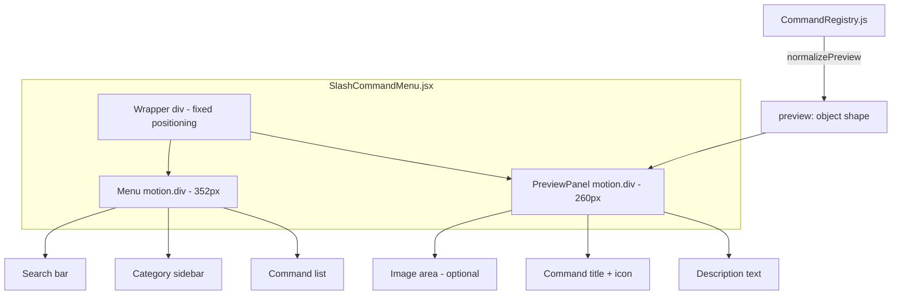

# Design: Slash Command Preview Panel (Phase A)

## Overview

Replace the existing bottom-panel text preview inside the slash command menu with a **side panel** that renders beside the menu (right by default, left on collision). The panel shows a description and optional illustrative image for the currently highlighted command, updating in real-time on keyboard navigation and mouse hover.

### Pre-Design Verification: FR-8 (Keyboard Navigation)

The existing `SlashCommandMenu.jsx` already wires `previewCmd` to `highlightedIndex` via a useEffect (line ~155):

```js
useEffect(() => {
  if (highlightedIndex >= 0 && flatItems[highlightedIndex] && !flatItems[highlightedIndex]._isGroup) {
    setPreviewCmd(flatItems[highlightedIndex]);
  } else {
    setPreviewCmd(null);
  }
}, [highlightedIndex, flatItems]);
```

**Verified behavior**: `previewCmd` updates on every ArrowUp/ArrowDown keystroke.

**Gap identified**: When the menu first opens, `highlightedIndex` starts at `-1`, so `previewCmd` is `null` until the first arrow press. Notion shows a preview immediately on open. **Fix**: On mount (when `open` becomes true), auto-set `highlightedIndex` to the first non-group item index.

### Key Design Decisions

| Decision | Choice | Rationale |
|----------|--------|-----------|
| Side panel DOM placement | Sibling `<motion.div>` outside menu's main `<motion.div>`, both wrapped in a shared positioning container | Avoids portal z-index wars. A portal would need manual z-index management; a sibling shares the existing stacking context naturally. |
| How to get menu bounding rect | Use existing `menuRef` + `getBoundingClientRect()` inside a `useLayoutEffect` | The ref is already forwarded from the parent. No new refs needed. |
| Backward-compat shim location | Normalize at registry read time (`getCommand`/`getAllCommands`) | Normalizing once at read means all consumers see a consistent shape. The preview component never needs branching logic. |
| Auto-highlight first item on open | Set `highlightedIndex` to first non-group index on `open` transition | Eliminates the "empty preview on menu open" gap. |

---

## Architecture



The wrapper `<div>` uses `position: fixed` with the same `top/left` from the `position` prop. It contains both the menu and the side panel as flex siblings (or absolute-positioned children). The side panel is positioned absolutely relative to the wrapper, offset by the menu width + gap.

---

## Components and Interfaces

### 1. New File: `src/components/editor/SlashCommandPreviewPanel.jsx`

**Why a separate file**: Keeps the already-large SlashCommandMenu.jsx (~280 lines) focused on menu logic. The preview panel has its own positioning, animation, and rendering concerns.

```jsx
// Props interface
{
  command: {           // The highlighted command (normalized shape)
    id: string,
    title: string,
    icon: string,
    preview: {
      description: string,
      image?: string   // Path to image asset, e.g. "/previews/toggle.png"
    }
  } | null,
  menuRect: DOMRect | null,  // From menuRef.getBoundingClientRect()
  side: "right" | "left",    // Computed by parent from viewport collision
  visible: boolean            // Controls AnimatePresence mount
}
```

**Responsibilities**:
- Render description text and optional image
- Animate in/out with framer-motion (slide + fade)
- Apply `role="complementary"` and `aria-label`
- Apply alt text to image from command title

### 2. Modifications to `SlashCommandMenu.jsx`

- **Remove** the existing bottom preview `<AnimatePresence>` block (the `border-t` section at the bottom)
- **Add** viewport collision detection logic (a `useMemo` computing `side`)
- **Add** `<SlashCommandPreviewPanel>` as a sibling after the menu's `<motion.div>`
- **Wrap** both in a non-visual `<div>` (no layout impact — just a React fragment alternative for ref forwarding)
- **Auto-highlight**: In the `useEffect([open])`, set `highlightedIndex` to the first non-group index instead of `-1`

### 3. Modifications to `CommandRegistry.js`

- **Add** `normalizePreview(cmd)` helper function
- **Modify** `getCommand()` and `getAllCommands()` to call `normalizePreview` on output
- **Add** `preview.image` field to 5–10 representative commands

### Interface: `normalizePreview`

```js
function normalizePreview(cmd) {
  if (!cmd) return cmd;
  const raw = cmd.preview;
  if (typeof raw === "string") {
    return { ...cmd, preview: { description: raw, image: undefined } };
  }
  if (raw && typeof raw === "object") {
    return { ...cmd, preview: { description: raw.description || "", image: raw.image } };
  }
  return { ...cmd, preview: { description: cmd.description || "", image: undefined } };
}
```

---

## Data Models

### Command Definition Schema (Extended)

```js
// Before (current — all 60+ commands)
{
  id: "toggle",
  title: "Toggle list",
  preview: "A collapsible section — hide/show nested blocks",  // string
  // ...
}

// After (new commands or upgraded commands)
{
  id: "toggle",
  title: "Toggle list",
  preview: {
    description: "A collapsible section — hide/show nested blocks",
    image: "/previews/toggle.png"  // Optional
  },
  // ...
}
```

### Backward Compatibility

The `normalizePreview()` shim in CommandRegistry.js ensures:
- `preview: "string"` → `{ description: "string", image: undefined }`
- `preview: { description, image }` → passed through as-is
- `preview: undefined/null` → `{ description: cmd.description, image: undefined }`

This runs at read time. **No mass rewrite** of existing command objects needed. Commands with images simply get their `preview` field changed from a string to the object form inline in CommandRegistry.js.

### Viewport Collision State

```js
// Computed inside SlashCommandMenu
const panelSide = useMemo(() => {
  if (!menuRect) return "right";
  const PANEL_WIDTH = 260;
  const GAP = 8;
  const spaceRight = window.innerWidth - menuRect.right;
  if (spaceRight >= PANEL_WIDTH + GAP) return "right";
  return "left";
}, [menuRect]);
```

---

## Correctness Properties

*A property is a characteristic or behavior that should hold true across all valid executions of a system — essentially, a formal statement about what the system should do. Properties serve as the bridge between human-readable specifications and machine-verifiable correctness guarantees.*

### Property 1: Preview tracks highlighted command

*For any* array of flat items (commands + group headers) and any valid `highlightedIndex` value, when `highlightedIndex` changes to point at a non-group item, `previewCmd` must equal that item. When it points at a group header or is -1, `previewCmd` must be `null`.

**Validates: Requirements 1.2, 1.8**

### Property 2: normalizePreview produces valid shape for all inputs

*For any* command object where `preview` is a string, an object `{ description, image? }`, `null`, or `undefined`, calling `normalizePreview(cmd)` must return a command with `preview.description` as a non-empty string (falling back to `cmd.description`) and `preview.image` as either a string or `undefined`. The output shape must always be `{ description: string, image: string | undefined }`.

**Validates: Requirements 1.3, 1.9**

### Property 3: Panel positioning correctness

*For any* menu bounding rect (top, left, width, height) and viewport dimensions (innerWidth, innerHeight), the computed panel position must satisfy:
- Panel does not overlap the menu (panel.left >= menu.right + gap OR panel.right <= menu.left - gap)
- Panel is fully within the viewport (panel.left >= 0, panel.right <= innerWidth, panel.top >= 0, panel.bottom <= innerHeight)
- Menu rect is unchanged regardless of panel presence

**Validates: Requirements 1.1, 1.6**

### Property 4: Panel visibility rule

*For any* combination of `highlightedIndex`, `flatItems` array, and viewport width, the panel `visible` flag must be `true` if and only if: `highlightedIndex >= 0` AND `flatItems[highlightedIndex]` exists AND `flatItems[highlightedIndex]._isGroup === false` AND `viewportWidth >= 500`.

**Validates: Requirements 1.7, 2.4**

### Property 5: Image rendering conditioned on preview.image

*For any* command passed to SlashCommandPreviewPanel, the rendered output contains an `` element if and only if `command.preview.image` is a non-empty string. When no image is present, no `` element or broken-image placeholder exists in the DOM.

**Validates: Requirements 1.4**

### Property 6: Accessibility attributes present for all commands

*For any* command rendered in the preview panel, the panel element has `role="complementary"` and a non-empty `aria-label`. When `command.preview.image` is present, the `` element has `alt` text containing the command title. The `aria-live` region contains the command title and description text.

**Validates: Requirements 1.10**

---

## Error Handling

| Scenario | Handling |
|----------|----------|
| `previewCmd.preview.image` path is invalid (404) | The `` uses `onError` to hide itself (set a local `imgFailed` state). No broken image icon shown. |
| `menuRef.current` is null (race condition on mount) | `menuRect` stays `null`, `panelSide` defaults to `"right"`, panel renders at default offset. Recalculates on next frame via `useLayoutEffect`. |
| `normalizePreview` receives command with no `preview` and no `description` | Falls back to empty string. Panel still renders with title + icon but no body text. |
| Viewport resizes while menu is open | `menuRect` is recalculated in a `useLayoutEffect` watching `previewCmd`. If resize causes side flip, panel smoothly transitions via framer-motion. |
| `highlightedIndex` exceeds `flatItems.length` (stale state) | Clamp check: if `flatItems[highlightedIndex]` is undefined, treat as `previewCmd = null`. |

---

## Testing Strategy

### Property-Based Tests (fast-check)

**Library**: [fast-check](https://github.com/dubzzz/fast-check) (already available via npm, zero config with Vite)

**Configuration**: Minimum 100 iterations per property test.

| Test | Property | Tag |
|------|----------|-----|
| `normalizePreview.property.test.js` | Property 2 | Feature: slash-command-preview-panel, Property 2: normalizePreview produces valid shape for all inputs |
| `panelPositioning.property.test.js` | Property 3 | Feature: slash-command-preview-panel, Property 3: Panel positioning correctness |
| `panelVisibility.property.test.js` | Property 4 | Feature: slash-command-preview-panel, Property 4: Panel visibility rule |
| `previewTracking.property.test.js` | Property 1 | Feature: slash-command-preview-panel, Property 1: Preview tracks highlighted command |
| `imageRendering.property.test.js` | Property 5 | Feature: slash-command-preview-panel, Property 5: Image rendering conditioned on preview.image |
| `accessibility.property.test.js` | Property 6 | Feature: slash-command-preview-panel, Property 6: Accessibility attributes present for all commands |

### Unit Tests (example-based)

| Test | Covers |
|------|--------|
| Auto-highlight first item on menu open | FR-8 gap fix |
| 5–10 specific commands have `preview.image` defined | FR-5 |
| Panel hidden at 499px, shown at 500px | NFR-4 boundary |
| Image `onError` hides the img element | Error handling |
| No new dependencies in package.json | NFR-2 |

### Integration Tests

| Test | Covers |
|------|--------|
| Full keyboard navigation flow: open menu → arrow down 5 times → verify panel content matches each step | FR-2 + FR-8 end-to-end |
| Mouse hover across multiple items → verify panel transitions | FR-2 |
| Menu positioned at right edge → verify panel renders on left | FR-6 visual |

---

## Component Structure (Section 1)

### File Organization

```
src/components/editor/
├── SlashCommandMenu.jsx          # Modified — removes bottom preview, adds wrapper + PreviewPanel
├── SlashCommandPreviewPanel.jsx   # NEW — renders the side panel
```

### Why a Separate File

- `SlashCommandMenu.jsx` is already ~280 lines handling search, keyboard nav, category tabs, and rendering. Adding positioning logic + image loading + animation for the side panel would push it past 400 lines.
- The preview panel has independent concerns: viewport collision, image error handling, ARIA attributes.
- Separate file enables isolated property testing of the panel component without mounting the full menu.

### Data Flow

```
SlashCommandMenu (parent)
  ├── Computes: previewCmd (from highlightedIndex + flatItems)
  ├── Computes: menuRect (from menuRef.getBoundingClientRect)
  ├── Computes: panelSide ("right" | "left" from viewport check)
  └── Passes to: <SlashCommandPreviewPanel command={previewCmd} menuRect={menuRect} side={panelSide} visible={!!previewCmd && viewportWidth >= 500} />
```

---

## Positioning Logic (Section 2)

### Approach: Absolute Positioning Within a Fixed Wrapper

```jsx
// Wrapper (replaces current motion.div as outermost)
<div style={{ position: "fixed", top: position.top, left: position.left, zIndex: 130 }}>
  {/* Menu */}
  <motion.div style={{ width: 352 }} className="...">
    {/* existing menu content */}
  </motion.div>

  {/* Side Preview Panel */}
  <SlashCommandPreviewPanel
    style={{
      position: "absolute",
      top: 0,
      [panelSide === "right" ? "left" : "right"]: 352 + 8, // menu width + gap
      width: 260
    }}
  />
</div>
```

### Viewport Collision Detection

```js
const menuRect = menuRef.current?.getBoundingClientRect();

// Right/Left flip
const PANEL_W = 260;
const GAP = 8;
const spaceRight = window.innerWidth - (menuRect?.right ?? 0);
const spaceLeft = menuRect?.left ?? 0;
const panelSide = spaceRight >= PANEL_W + GAP ? "right" : "left";

// Top/Bottom clamp: ensure panel doesn't exceed viewport
const panelHeight = 300; // approximate max height
const maxTop = window.innerHeight - panelHeight;
const clampedTop = Math.max(0, Math.min(menuRect?.top ?? 0, maxTop));
```

### Confirming NFR-1: No Menu Shift

The wrapper div has **no flex or grid layout**. Children use absolute positioning. The menu's `width: 352` is hardcoded. The preview panel is `position: absolute` — it does **not** participate in any layout flow that could push or resize the menu.

---

## Data Schema Migration (Section 3)

### Shim: `normalizePreview` in CommandRegistry.js

```js
// Added to CommandRegistry.js
function normalizePreview(cmd) {
  if (!cmd) return cmd;
  const raw = cmd.preview;
  if (typeof raw === "string") {
    return { ...cmd, preview: { description: raw } };
  }
  if (raw && typeof raw === "object" && typeof raw.description === "string") {
    return cmd; // Already correct shape
  }
  // Fallback: no preview field or unexpected type
  return { ...cmd, preview: { description: cmd.description || "" } };
}

// Modified exports
export function getCommand(id) {
  return normalizePreview(_commands.get(id));
}

export function getAllCommands() {
  return Array.from(_commands.values()).map(normalizePreview);
}

export function getFilteredCommands(query, ctx = {}) {
  // ... existing filter logic ...
  return filtered.map(normalizePreview);
}
```

### No Breakage Confirmation

- All existing code that reads `cmd.preview` currently expects a string and renders it as text.
- After the shim, `cmd.preview` is always `{ description: string, image?: string }`.
- **The only consumer of `cmd.preview`** is the preview rendering in `SlashCommandMenu.jsx`, which we're replacing.
- The existing `aria-live` region uses `previewCmd.preview` as text — it will be updated to use `previewCmd.preview.description`.
- No other files import or use the `preview` field.

---

## Image Asset Plan (Section 4)

### Commands Getting Images (Phase A)

| # | Command ID | Category | Image File | Rationale |
|---|-----------|----------|------------|-----------|
| 1 | `text` | Basic blocks | `/previews/text.png` | Most common block type |
| 2 | `toggle` | Basic blocks | `/previews/toggle.png` | Visually distinctive |
| 3 | `table-view` | Database | `/previews/table-view.png` | Database flagship |
| 4 | `board-view` | Database | `/previews/board-view.png` | Kanban is visually recognizable |
| 5 | `image` | Media | `/previews/image.png` | Meta — an image block's preview |
| 6 | `code` | Media | `/previews/code.png` | Syntax highlighting showcase |
| 7 | `mention-page` | Inline | `/previews/mention-page.png` | Key collaboration feature |
| 8 | `table-of-contents` | Advanced blocks | `/previews/table-of-contents.png` | Shows navigation value |
| 9 | `2-columns` | Layout | `/previews/2-columns.png` | Layout visual |
| 10 | `callout` | Basic blocks | `/previews/callout.png` | Colorful, distinctive |

### Storage Location

```
public/previews/
├── text.png
├── toggle.png
├── table-view.png
├── board-view.png
├── image.png
├── code.png
├── mention-page.png
├── table-of-contents.png
├── 2-columns.png
└── callout.png
```

**Format**: PNG, ~200×120px, schematic/placeholder illustrations for Phase A. These are simple diagrams showing what the block looks like (similar to Notion's approach). Full polished illustrations deferred to Phase G.

**Vite serves `public/` at root**, so paths in code are `/previews/toggle.png` → served as-is.

---

## Accessibility Implementation (Section 5)

### What's Already Implemented

| Feature | Current State |
|---------|--------------|
| `aria-live="polite"` region | ✅ Exists — announces `previewCmd.title + description` |
| `role="dialog"` on menu | ✅ Exists |
| `role="combobox"` on input | ✅ Exists |
| `role="listbox"` on results | ✅ Exists |
| `aria-selected` on items | ✅ Exists |
| `aria-activedescendant` | ✅ Exists |

### What's New (FR-10)

| Feature | Implementation |
|---------|---------------|
| `role="complementary"` on preview panel | Add to panel's root `<aside>` or `<div>` |
| `aria-label` on panel | `aria-label="Command preview"` |
| `alt` text on preview image | `alt={`${command.title} preview`}` |
| Update `aria-live` content | Change from `previewCmd.preview` (was string) to `previewCmd.preview.description` |

### Implementation Detail

```jsx
// SlashCommandPreviewPanel.jsx
<motion.aside
  role="complementary"
  aria-label="Command preview"
  // ...positioning styles
>
  {command.preview.image && (
     e.target.style.display = "none"}
      className="w-full rounded-lg mb-2"
    />
  )}
  <div className="font-medium text-sm">{command.title}</div>
  <p className="text-xs text-[var(--muted)]">{command.preview.description}</p>
</motion.aside>
```

The existing `aria-live` region in `SlashCommandMenu.jsx` stays in place but updates its text source:
```jsx
<div aria-live="polite" aria-atomic="true" className="sr-only">
  {previewCmd ? `${previewCmd.title} — ${previewCmd.preview.description}` : ""}
</div>
```

---

## Responsive Behavior (Section 6)

### Approach: CSS Media Query via Tailwind + JS Guard

**Chosen approach**: JavaScript `window.innerWidth` check (not pure CSS).

**Justification**:
- The panel is conditionally mounted via React (`visible` prop). A CSS `display: none` would still mount the DOM node and run image loading.
- A JS check prevents the component from mounting at all below 500px — no wasted renders, no image prefetches.
- Tailwind's responsive utilities (`hidden md:block`) operate on fixed breakpoints (640px, 768px, etc.) — 500px isn't a standard breakpoint.

**Implementation**:

```js
// Inside SlashCommandMenu.jsx
const [viewportWidth, setViewportWidth] = useState(window.innerWidth);

useEffect(() => {
  const handler = () => setViewportWidth(window.innerWidth);
  window.addEventListener("resize", handler);
  return () => window.removeEventListener("resize", handler);
}, []);

const panelVisible = !!previewCmd && viewportWidth >= 500;
```

The `panelVisible` flag is passed as `visible` to `SlashCommandPreviewPanel`. When `false`, the panel is not rendered (AnimatePresence exit animation plays, then unmount).

---

## Risk Notes (Section 7)

| Risk | Severity | Mitigation |
|------|----------|------------|
| **menuRef timing**: `getBoundingClientRect()` may return zeros on first render frame before layout completes | Low | Use `useLayoutEffect` + guard against zero-rect. Fallback: position right with default offset. |
| **Stale menuRect on scroll**: If the page scrolls while the menu is open, `position: fixed` stays correct but `menuRect` may be stale | Low | The menu already uses fixed positioning and the parent re-renders on `position` prop changes. Scroll while slash menu is open is unusual (menu closes on outside click). |
| **z-index conflicts with other fixed elements** (e.g., sidebar, topbar) | Medium | The menu already uses `z-[130]`. The wrapper inherits this. If other elements use higher z-index, the panel could be hidden. Verify against existing z-index scale. |
| **Image loading flash**: First time a command with an image is highlighted, there may be a flash while the image loads | Low | Images are small (~200×120 PNG). Could add a skeleton/placeholder, but for Phase A the flash is acceptable. Phase G can add preloading. |
| **Assumption: only one consumer of `cmd.preview`** | Medium | Grep confirmed: only `SlashCommandMenu.jsx` reads `.preview`. But if future code reads it expecting a string, it will break. The normalizePreview shim at the registry level ensures all consumers get the object shape. |
| **No test framework currently in package.json** | High | fast-check and a test runner (vitest) need to be added as devDependencies. This is allowed by NFR-2 which says "no new *runtime* dependencies" — test dependencies are dev-only. |
