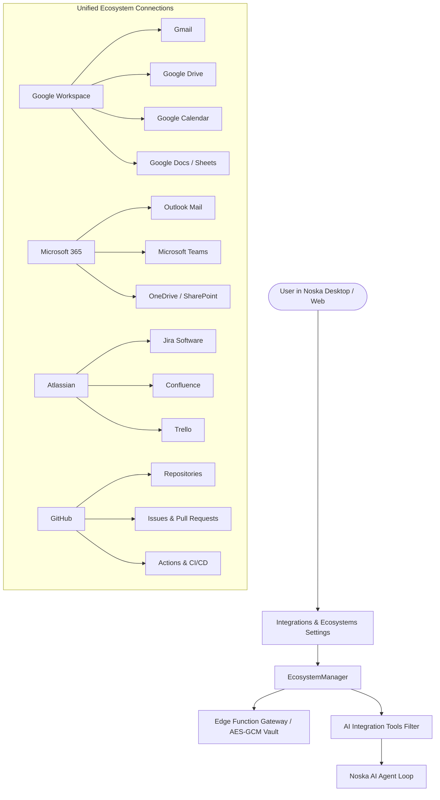
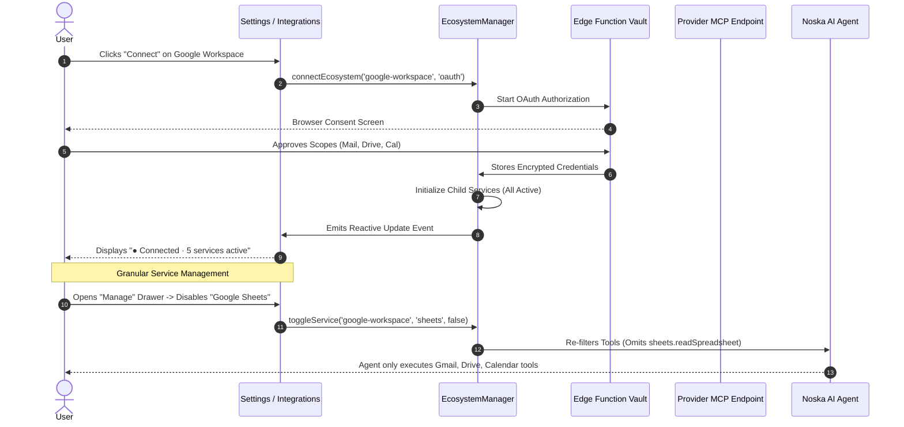

# Noska Integrations & Ecosystem Architecture Guide

---

## 1. Overview & Vision

Noska's **Ecosystem-First Connector Architecture** unifies related cloud services under a single parent connection. Rather than presenting fragmented, disconnected cards for individual products (such as separate cards for Gmail, Google Drive, and Google Calendar), users authorize their parent workspace once and gain granular, least-privilege control over all underlying services and data assets.



---

## 2. Core Architectural Pillars

### 2.1 Ecosystem-First vs. Legacy Connectors
- **Single Authorization Flow**: One OAuth or API key authorization activates the ecosystem suite.
- **Granular Service Toggles**: Users can disable specific child services (e.g. disable Google Sheets while keeping Gmail and Google Drive active).
- **Granular Resource Selection**: Users explicitly select which repositories, shared drives, calendars, or channels AI agents are allowed to access.
- **Least-Privilege Enforcement**: AI tool definitions are filtered in real-time. If a service is turned off, its tools are completely hidden from the agent prompt context.

### 2.2 Performance & Zero Interval Polling
- **No Background Polling Loops**: Eliminates heavy 2-minute periodic polling intervals that cause high network usage, battery drain, and rate limit errors.
- **On-Demand Synchronization**: Resources and status are synced only when the user opens the settings, clicks `Sync`, or connects an account.
- **Last-Known-Good Resilience**: If an external provider API is unreachable or times out, cached resources remain available without throwing blocking errors.

### 2.3 Security & Encryption
- **AES-GCM Encryption at Rest**: Authentication tokens are encrypted in edge vaults and never exposed to the client renderer.
- **Strict Duplicate Prevention**: Multiple connection attempts for the same account are reconciled based on `(provider_id, external_account_id, tenant_id)`.
- **Instant Revocation**: Disconnecting an ecosystem revokes access tokens and scrubs all related agent tools in one action.

---

## 3. Provider-by-Provider Catalog (28 Ecosystems)

Below is the complete reference guide for all supported ecosystem connectors, their child services, permission scopes, resource types, and agent tools.

---

### 1. Google Workspace
- **Category**: Workspace
- **Tagline**: Gmail · Drive · Calendar · Docs · Sheets · Meet · Tasks
- **Auth Modes**: OAuth 2.0
- **Child Services**:
  | Service | Capabilities | Unlocked Agent Tools |
  | :--- | :--- | :--- |
  | **Gmail** | Read emails, thread inspection, draft creation | `gmail.search`, `gmail.getThread`, `gmail.createDraft`, `gmail.sendEmail` |
  | **Google Drive** | Search files, inspect folders, read cloud documents | `drive.search`, `drive.getFile`, `drive.exportDoc`, `drive.createFolder` |
  | **Google Calendar** | Schedule events, inspect agendas, free/busy check | `calendar.listEvents`, `calendar.createEvent`, `calendar.findFreeSlots` |
  | **Google Docs** | Read document body, insert text, format content | `docs.readDocument`, `docs.insertText`, `docs.createDocument` |
  | **Google Sheets** | Read rows/columns, append data, update cells | `sheets.readSpreadsheet`, `sheets.appendRows`, `sheets.updateValues` |
  | **Google Meet** | Generate video meeting links, list upcoming calls | `meet.createMeeting`, `meet.listRecordings` |
  | **Google Tasks** | Manage personal and workspace task lists | `tasks.listTasks`, `tasks.createTask`, `tasks.completeTask` |

---

### 2. Microsoft 365
- **Category**: Workspace
- **Tagline**: Outlook · OneDrive · SharePoint · Teams · Calendar · OneNote · Excel
- **Auth Modes**: OAuth 2.0
- **Child Services**:
  | Service | Capabilities | Unlocked Agent Tools |
  | :--- | :--- | :--- |
  | **Outlook Mail** | Search inboxes, read messages, compose replies | `outlook.search`, `outlook.getMessage`, `outlook.draftMessage` |
  | **OneDrive** | Browse personal cloud files, download attachments | `onedrive.listFiles`, `onedrive.downloadFile`, `onedrive.upload` |
  | **SharePoint** | Access team sites, corporate document libraries | `sharepoint.searchSites`, `sharepoint.getLibraryItems` |
  | **Microsoft Teams** | Read team channel messages, post status updates | `teams.listChannels`, `teams.postMessage`, `teams.createChat` |
  | **Microsoft Calendar**| Query schedules, book meetings | `mscalendar.getSchedule`, `mscalendar.createEvent` |
  | **OneNote** | Search notebooks, read pages, create notes | `onenote.listPages`, `onenote.createPage`, `onenote.appendContent` |
  | **Excel Online** | Query tables, calculate models, append rows | `excel.queryTable`, `excel.appendRow`, `excel.updateRange` |

---

### 3. Atlassian
- **Category**: Project Management
- **Tagline**: Jira Software · Confluence · Trello · Bitbucket · Jira Service Desk
- **Auth Modes**: OAuth 2.0, API Token
- **Child Services**:
  | Service | Capabilities | Unlocked Agent Tools |
  | :--- | :--- | :--- |
  | **Jira Software** | Manage issues, sprints, boards, backlog triage | `jira.searchIssues`, `jira.createIssue`, `jira.updateStatus`, `jira.assignIssue` |
  | **Confluence** | Search knowledge bases, read documentation spaces | `confluence.search`, `confluence.getPage`, `confluence.createPage` |
  | **Trello** | Inspect Kanban boards, manage cards and lists | `trello.getBoards`, `trello.createCard`, `trello.moveCard` |
  | **Bitbucket** | Inspect code repositories, review pull requests | `bitbucket.listRepos`, `bitbucket.getPullRequest`, `bitbucket.postComment` |

---

### 4. GitHub
- **Category**: Development
- **Tagline**: Repositories · Issues · Pull Requests · Actions · Discussions
- **Auth Modes**: OAuth 2.0, Personal Access Token (PAT)
- **Child Services**:
  | Service | Capabilities | Unlocked Agent Tools |
  | :--- | :--- | :--- |
  | **Repositories** | Search source code, browse file trees, inspect commits | `github.searchCode`, `github.getFileContent`, `github.createBranch` |
  | **Issues & PRs** | Create issues, review pull requests, add comments | `github.createIssue`, `github.getPullRequest`, `github.mergePullRequest` |
  | **GitHub Actions** | Monitor CI/CD runs, trigger workflow dispatches | `github.listWorkflows`, `github.dispatchWorkflow`, `github.getRunLogs` |
  | **Discussions** | Read community discussions, answer user questions | `github.searchDiscussions`, `github.replyDiscussion` |

---

### 5. Slack
- **Category**: Communication
- **Tagline**: Channels · Direct Messages · Canvas · Workflows · Search
- **Auth Modes**: OAuth 2.0
- **Child Services**:
  | Service | Capabilities | Unlocked Agent Tools |
  | :--- | :--- | :--- |
  | **Channels & DMs** | Read channel threads, post message notifications | `slack.searchMessages`, `slack.postMessage`, `slack.getConversation` |
  | **Canvas** | Read and format shared team canvases | `slack.getCanvas`, `slack.updateCanvas` |
  | **Workflows** | Trigger interactive Slack workflows | `slack.triggerWorkflow` |

---

### 6. Notion
- **Category**: Workspace
- **Tagline**: Pages · Databases · Comments · Notion AI Knowledge
- **Auth Modes**: OAuth 2.0, Internal Integration Token
- **Child Services**:
  | Service | Capabilities | Unlocked Agent Tools |
  | :--- | :--- | :--- |
  | **Pages & Databases**| Query structured databases, read page blocks | `notion.search`, `notion.queryDatabase`, `notion.createPage`, `notion.updateBlock` |
  | **Comments** | Add inline review comments to Notion documents | `notion.createComment`, `notion.listComments` |

---

### 7. Figma
- **Category**: Design
- **Tagline**: Files & Canvas · Design Comments · Dev Mode & Variables
- **Auth Modes**: OAuth 2.0, Personal Access Token
- **Child Services**:
  | Service | Capabilities | Unlocked Agent Tools |
  | :--- | :--- | :--- |
  | **Files & Canvas** | Inspect node trees, export vector assets, read components | `figma.getFile`, `figma.getNode`, `figma.exportImage` |
  | **Design Comments** | Read designer feedback, post annotations | `figma.getComments`, `figma.postComment` |
  | **Design Tokens** | Read Figma variables, styles, and color palettes | `figma.getVariables`, `figma.getStyles` |

---

### 8. Linear
- **Category**: Project Management
- **Tagline**: Issues · Projects · Cycles · Roadmaps
- **Auth Modes**: OAuth 2.0, Personal API Key
- **Child Services**:
  | Service | Capabilities | Unlocked Agent Tools |
  | :--- | :--- | :--- |
  | **Issues & Cycles** | Manage engineering issues, triage cycles, assign priorities | `linear.searchIssues`, `linear.createIssue`, `linear.updateIssue` |
  | **Projects & Roadmap**| Query milestones, inspect project health | `linear.getProjects`, `linear.updateProjectStatus` |

---

### 9. ClickUp
- **Category**: Project Management
- **Tagline**: Tasks · Docs · Dashboards · Goals
- **Auth Modes**: OAuth 2.0, API Token
- **Child Services**:
  | Service | Capabilities | Unlocked Agent Tools |
  | :--- | :--- | :--- |
  | **Tasks** | Manage task spaces, folders, and custom task fields | `clickup.getTasks`, `clickup.createTask`, `clickup.updateTask` |
  | **ClickUp Docs** | Read collaborative documents, append summaries | `clickup.getDoc`, `clickup.createDoc` |

---

### 10. Asana
- **Category**: Project Management
- **Tagline**: Tasks · Projects · Portfolios · Goals
- **Auth Modes**: OAuth 2.0, Personal Access Token
- **Child Services**:
  | Service | Capabilities | Unlocked Agent Tools |
  | :--- | :--- | :--- |
  | **Tasks & Projects**| Manage sprint projects, create subtasks | `asana.getTasks`, `asana.createTask`, `asana.updateTask` |
  | **Portfolios** | Track cross-functional initiatives | `asana.getPortfolios`, `asana.getProjectStatus` |

---

### 11. Discord
- **Category**: Communication
- **Tagline**: Channels · Voice & Video · Forums · Community Members
- **Auth Modes**: OAuth 2.0, Bot Token
- **Child Services**:
  | Service | Capabilities | Unlocked Agent Tools |
  | :--- | :--- | :--- |
  | **Guild Channels** | Read channel history, send formatted embeds | `discord.getMessages`, `discord.sendMessage`, `discord.sendEmbed` |
  | **Forums & Threads**| Query community support questions | `discord.listThreads`, `discord.createThread` |

---

### 12. Zoom
- **Category**: Communication
- **Tagline**: Meetings · Cloud Recordings · Transcripts · Webinars
- **Auth Modes**: OAuth 2.0
- **Child Services**:
  | Service | Capabilities | Unlocked Agent Tools |
  | :--- | :--- | :--- |
  | **Meetings** | Schedule video calls, manage attendee invites | `zoom.createMeeting`, `zoom.listMeetings` |
  | **Cloud Recordings**| Fetch automated AI transcripts and summaries | `zoom.getRecordings`, `zoom.getTranscript` |

---

### 13. Dropbox
- **Category**: Files
- **Tagline**: Files & Folders · Dropbox Paper · Signatures
- **Auth Modes**: OAuth 2.0
- **Child Services**:
  | Service | Capabilities | Unlocked Agent Tools |
  | :--- | :--- | :--- |
  | **File Storage** | Upload, download, and share cloud documents | `dropbox.searchFiles`, `dropbox.downloadFile`, `dropbox.uploadFile` |
  | **Dropbox Paper** | Read collaborative paper notes | `dropbox.getPaperDoc`, `dropbox.createPaperDoc` |

---

### 14. Box
- **Category**: Files
- **Tagline**: Cloud Content · Box Notes · Enterprise Governance
- **Auth Modes**: OAuth 2.0
- **Child Services**:
  | Service | Capabilities | Unlocked Agent Tools |
  | :--- | :--- | :--- |
  | **Box Content** | Search enterprise files, manage folder permissions | `box.searchFiles`, `box.getFile`, `box.uploadFile` |

---

### 15. Vercel
- **Category**: Development
- **Tagline**: Projects · Deployments · Domains · Build Logs
- **Auth Modes**: OAuth 2.0, Personal Token
- **Child Services**:
  | Service | Capabilities | Unlocked Agent Tools |
  | :--- | :--- | :--- |
  | **Deployments** | Trigger builds, inspect preview URLs, check build logs | `vercel.listDeployments`, `vercel.getDeploymentLogs`, `vercel.redeploy` |
  | **Projects & Domains**| Query environment variables and DNS records | `vercel.getProjects`, `vercel.getEnvVars` |

---

### 16. Supabase
- **Category**: Data
- **Tagline**: Postgres Databases · Auth · Storage · Edge Functions
- **Auth Modes**: Personal Access Token, Management API Key
- **Child Services**:
  | Service | Capabilities | Unlocked Agent Tools |
  | :--- | :--- | :--- |
  | **Database & SQL** | Query tables, generate migrations, inspect schema | `supabase.querySql`, `supabase.listTables`, `supabase.getSchema` |
  | **Edge Functions** | Inspect function logs, deploy edge scripts | `supabase.listFunctions`, `supabase.getFunctionLogs` |
  | **Storage Buckets** | Browse asset buckets and signed upload URLs | `supabase.listBuckets`, `supabase.getSignedUrl` |

---

### 17. Airtable
- **Category**: Data
- **Tagline**: Bases · Tables & Records · Interfaces · Automations
- **Auth Modes**: OAuth 2.0, Personal Access Token
- **Child Services**:
  | Service | Capabilities | Unlocked Agent Tools |
  | :--- | :--- | :--- |
  | **Tables & Records**| Query relational tables, filter records, insert rows | `airtable.listRecords`, `airtable.createRecord`, `airtable.updateRecord` |
  | **Base Schema** | Inspect field definitions, formulas, and views | `airtable.getBaseSchema` |

---

### 18. HubSpot
- **Category**: Data
- **Tagline**: CRM Contacts · Deals · Marketing Campaigns · Service Tickets
- **Auth Modes**: OAuth 2.0, Private App Token
- **Child Services**:
  | Service | Capabilities | Unlocked Agent Tools |
  | :--- | :--- | :--- |
  | **CRM & Deals** | Search customer contacts, update deal pipeline stages | `hubspot.searchContacts`, `hubspot.getDeals`, `hubspot.createDeal` |
  | **Service Tickets** | Inspect support tickets, log customer interactions | `hubspot.getTickets`, `hubspot.createTicket` |

---

### 19. Salesforce
- **Category**: Data
- **Tagline**: Leads & Opportunities · Accounts · Cases · Reports
- **Auth Modes**: OAuth 2.0
- **Child Services**:
  | Service | Capabilities | Unlocked Agent Tools |
  | :--- | :--- | :--- |
  | **CRM Objects** | Query SOQL objects, update sales opportunities | `salesforce.querySoql`, `salesforce.getAccount`, `salesforce.updateOpportunity` |
  | **Cases & Support** | Triage support cases, assign customer priority | `salesforce.getCases`, `salesforce.createCase` |

---

### 20. Intercom
- **Category**: Communication
- **Tagline**: Helpdesk Inbox · Knowledge Articles · Customer Profiles
- **Auth Modes**: OAuth 2.0, Access Token
- **Child Services**:
  | Service | Capabilities | Unlocked Agent Tools |
  | :--- | :--- | :--- |
  | **Helpdesk Inbox** | Read customer conversations, send reply messages | `intercom.listConversations`, `intercom.replyConversation` |
  | **Help Center** | Search public help articles, draft knowledge bases | `intercom.getArticles`, `intercom.createArticle` |

---

### 21. Zendesk
- **Category**: Communication
- **Tagline**: Support Tickets · Help Center · Users & Organizations
- **Auth Modes**: OAuth 2.0, API Token
- **Child Services**:
  | Service | Capabilities | Unlocked Agent Tools |
  | :--- | :--- | :--- |
  | **Support Tickets** | Query open tickets, post internal notes, assign agents | `zendesk.searchTickets`, `zendesk.updateTicket`, `zendesk.createTicket` |
  | **Guide Articles** | Query knowledge base solutions | `zendesk.getArticles` |

---

### 22. Stripe
- **Category**: Data
- **Tagline**: Payments & Charges · Customers · Invoices · Subscriptions
- **Auth Modes**: Restricted API Key, OAuth
- **Child Services**:
  | Service | Capabilities | Unlocked Agent Tools |
  | :--- | :--- | :--- |
  | **Billing & Payments**| Inspect transactions, query subscriptions, generate invoices | `stripe.searchCustomers`, `stripe.getInvoices`, `stripe.createInvoice` |
  | **Financial Reports** | Check account balances and payout schedules | `stripe.getBalance`, `stripe.listCharges` |

---

### 23. Shopify
- **Category**: Automation
- **Tagline**: Products & Inventory · Orders · Customers · Store Analytics
- **Auth Modes**: Admin API Access Token
- **Child Services**:
  | Service | Capabilities | Unlocked Agent Tools |
  | :--- | :--- | :--- |
  | **Store Inventory** | Search product catalog, check SKU inventory levels | `shopify.getProducts`, `shopify.updateInventory` |
  | **Orders** | Inspect customer orders, check fulfillment tracking | `shopify.getOrders`, `shopify.fulfillOrder` |

---

### 24. Zapier
- **Category**: Automation
- **Tagline**: Zaps · Multi-Step Actions · Tables & Interfaces
- **Auth Modes**: OAuth 2.0, NLA Key
- **Child Services**:
  | Service | Capabilities | Unlocked Agent Tools |
  | :--- | :--- | :--- |
  | **Zap Actions** | Execute connected Zapier triggers and webhooks | `zapier.listActions`, `zapier.executeAction` |

---

### 25. Make (Integromat)
- **Category**: Automation
- **Tagline**: Scenarios · Data Stores · Custom Webhooks
- **Auth Modes**: API Key
- **Child Services**:
  | Service | Capabilities | Unlocked Agent Tools |
  | :--- | :--- | :--- |
  | **Scenarios** | Trigger automated scenarios, check execution logs | `make.triggerScenario`, `make.getScenarioStatus` |

---

### 26. n8n
- **Category**: Automation
- **Tagline**: Workflows · Self-Hosted Automation · Webhooks
- **Auth Modes**: API Key
- **Child Services**:
  | Service | Capabilities | Unlocked Agent Tools |
  | :--- | :--- | :--- |
  | **Workflows** | Execute local/cloud workflow nodes, inspect data payloads | `n8n.triggerWorkflow`, `n8n.getExecution` |

---

### 27. GitLab
- **Category**: Development
- **Tagline**: Projects · Issues & MRs · CI/CD Pipelines · Wikis
- **Auth Modes**: OAuth 2.0, Personal Access Token
- **Child Services**:
  | Service | Capabilities | Unlocked Agent Tools |
  | :--- | :--- | :--- |
  | **Projects & Repos**| Browse source code, create branches, inspect commits | `gitlab.getProject`, `gitlab.getFile`, `gitlab.createMergeRequest` |
  | **Pipelines** | Inspect CI/CD pipeline statuses, retry failed jobs | `gitlab.getPipelines`, `gitlab.retryJob` |

---

### 28. Bitbucket
- **Category**: Development
- **Tagline**: Repositories · Pull Requests · Pipelines · Code Snippets
- **Auth Modes**: OAuth 2.0, App Password
- **Child Services**:
  | Service | Capabilities | Unlocked Agent Tools |
  | :--- | :--- | :--- |
  | **Repositories & PRs**| Review pull requests, read commit diffs | `bitbucket.listRepos`, `bitbucket.getPullRequest`, `bitbucket.createPullRequest` |

---

## 4. UI Architecture & Interaction Flow



---

## 5. Developer Guide: Adding New Ecosystems

To add a new ecosystem to Noska:

1. **Define Contract in `src/lib/connections/types.ts`**: Ensure service and permission categories map properly.
2. **Register Connector in `src/lib/connections/ecosystemRegistry.ts`**:
   ```typescript
   {
     id: "my-ecosystem",
     slug: "my-ecosystem",
     name: "My Ecosystem",
     description: "Description of the ecosystem suite.",
     tagline: "Service A · Service B · Service C",
     category: "Development",
     icon: "my-icon",
     brandColor: "#123456",
     authModes: ["oauth", "token"],
     defaultScopes: ["read", "write"],
     services: [ ... ],
   }
   ```
3. **Register Brand SVG in `src/components/BrandIcon.tsx`**: Add the vector path and hex color.
4. **Map Tools in `src/ai/integrationTools.ts`**: The ecosystem manager automatically maps and filters tools named `<ecosystem>__<service>__<action>` or `<service>.<action>`.

---

*Document created and maintained for the Noska Core Platform Architecture.*
